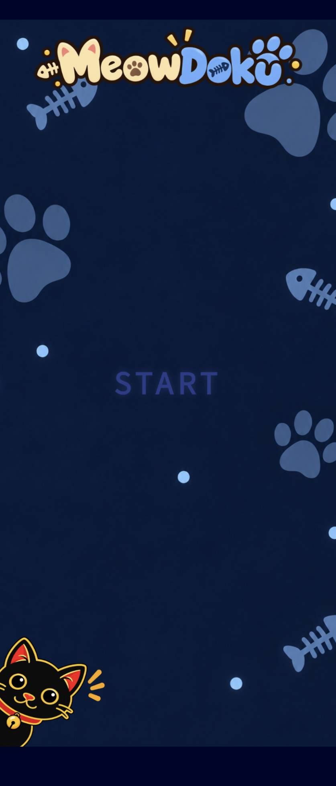
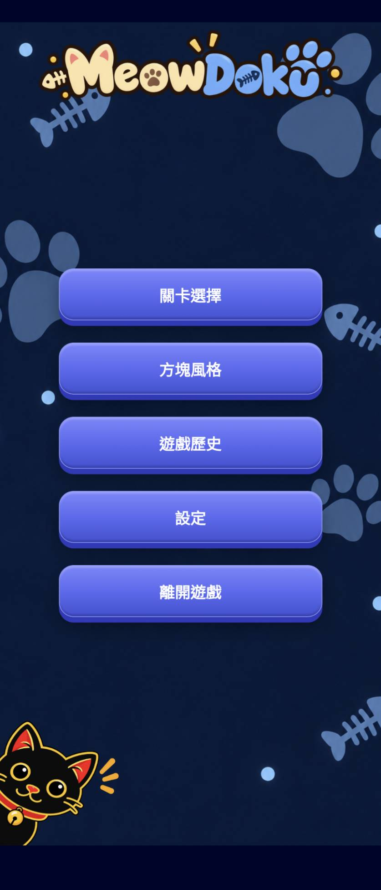
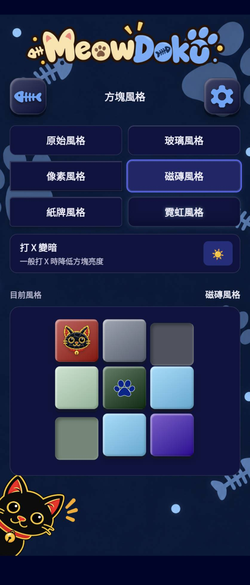
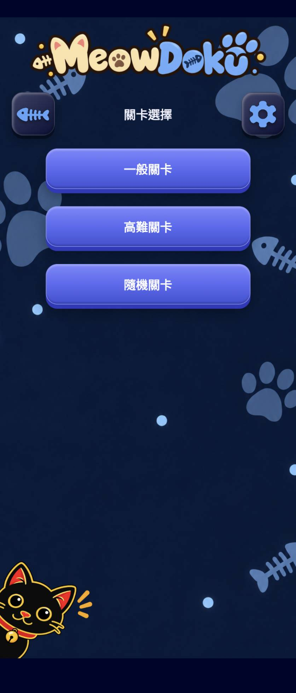
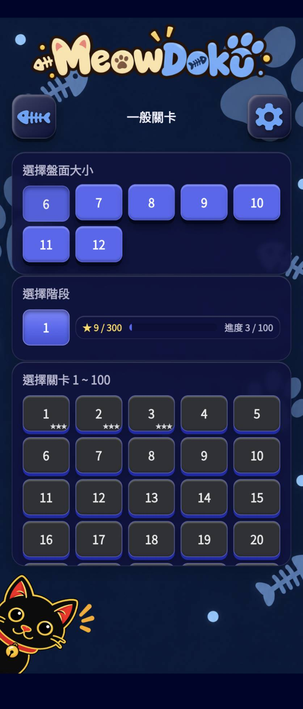
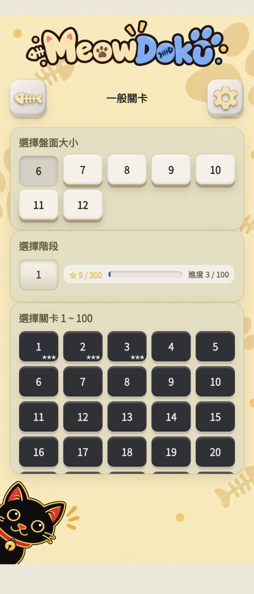
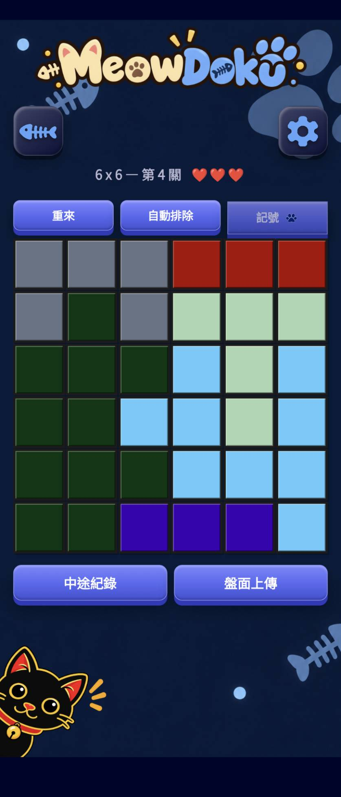
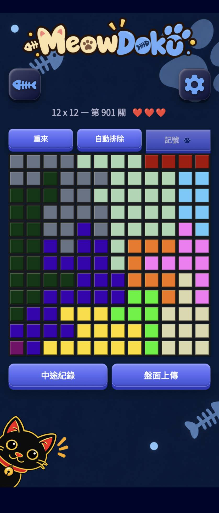

# MeowDoku Android

MeowDoku 是一款以貓咪為主題的 Android 邏輯益智遊戲。玩家需要根據行、列與顏色區域的限制，找出每隻貓咪的位置。

## 下載安裝

[下載最新版 MeowDoku Android v1.3.2 APK](https://github.com/NanbuShirou/MeowDoku_android/releases/download/v1.3.2/Meowdoku.Android.v1.3.2.apk)

- 最低支援 Android 6.0。
- 下載 APK 後開啟檔案，依照 Android 提示允許安裝未知來源應用程式。
- 安裝更新前，建議保留原有 App，以免清除遊戲紀錄與設定。

## 遊戲規則

每個盤面必須同時符合以下規則：

- 每一橫列恰好有一隻貓咪。
- 每一直行恰好有一隻貓咪。
- 每個顏色區域恰好有一隻貓咪。
- 任意兩隻貓咪不能相鄰，包含上下、左右與斜角。

## 操作方式

- 點一下格子：放置或取消提醒記號。
- 快速點兩下格子：猜測該格有貓咪。
- 按住並拖曳：連續放置相同的提醒記號。
- 猜錯會扣除一次機會；每局共有三次機會。

## 關卡模式

### 一般關卡

- 提供 6×6 至 12×12 七種盤面尺寸。
- 可依階段與關卡編號選擇遊玩。
- 過關時會依剩餘機會獲得星星。

### 高難度關卡

- 提供更具挑戰性的固定關卡。
- App 內建初始關卡；啟動時會檢查線上關卡 manifest，有新增關卡時下載更新包。
- 同樣會記錄完成進度與獲得星星數。

### 隨機關卡

- 可選擇 6×6 至 12×12 盤面，即時產生新關卡。
- 記錄各尺寸的過關次數、最快時間與最高分數。
- 過關後可保存並命名該關的分享碼。
- 在隨機關卡選擇頁可手動輸入分享碼，或從只顯示名稱的已保存清單選擇；選取後會將分享碼帶入輸入欄，也可重新命名與刪除關卡。
- 經由分享碼載入的關卡不列入過關次數、最快時間、最高分數、找到貓咪數及猜錯次數。

## 中途紀錄

遊戲中可保存目前進度並返回選關畫面。再次開啟同一關卡時，可以從保存的位置繼續遊玩。

## 遊戲歷史

遊戲歷史頁會顯示：

- 一般關卡與高難度關卡的完成進度及星星數。
- 七種隨機關卡尺寸各自的過關次數、最快時間及最高分數。
- 累計猜錯次數、找到貓咪數及遊玩總時間。

## 個人化設定

- 深色與淺色主題。
- 多種方塊風格及區域顏色。
- 背景音樂曲目、音量、單曲循環與全部循環。
- 震動、自動排除、提醒記號圖示等遊戲設定。

## 遊戲畫面

| 遊戲初始畫面 | 遊戲選單 |
| --- | --- |
|  |  |

| 選擇方塊風格 | 遊戲選關畫面 |
| --- | --- |
|  |  |

| 遊戲選關畫面－階層 | 遊戲選關畫面－主題變更 |
| --- | --- |
|  |  |

| 遊戲畫面 6×6 | 遊戲畫面 10×10 |
| --- | --- |
|  |  |

## 檔案驗證

`Meowdoku.Android.v1.3.2.apk`

```text
SHA-256: C7A71E8B0DF4FC0F98172BEA39CC709D53235BE9D064CC45DF9F2384A391AD25
```

## 授權說明

本倉庫僅提供 Android APK 與遊戲使用說明，特別感謝 yocox。
