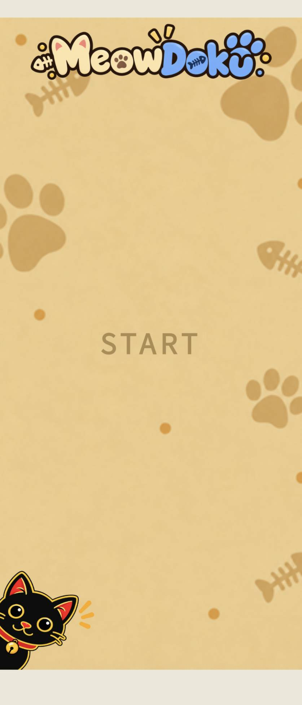
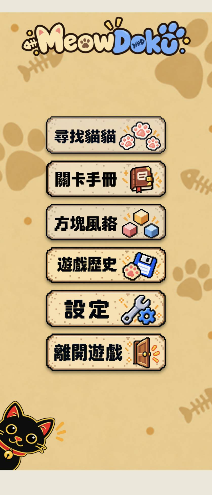
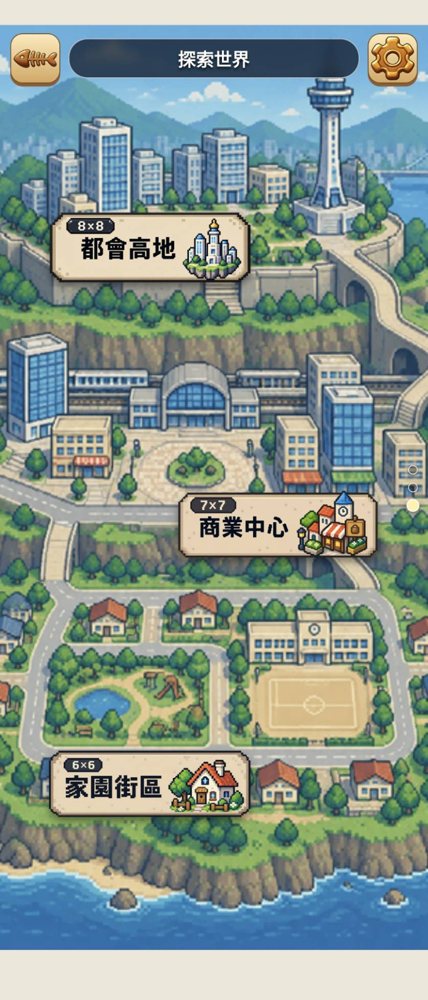
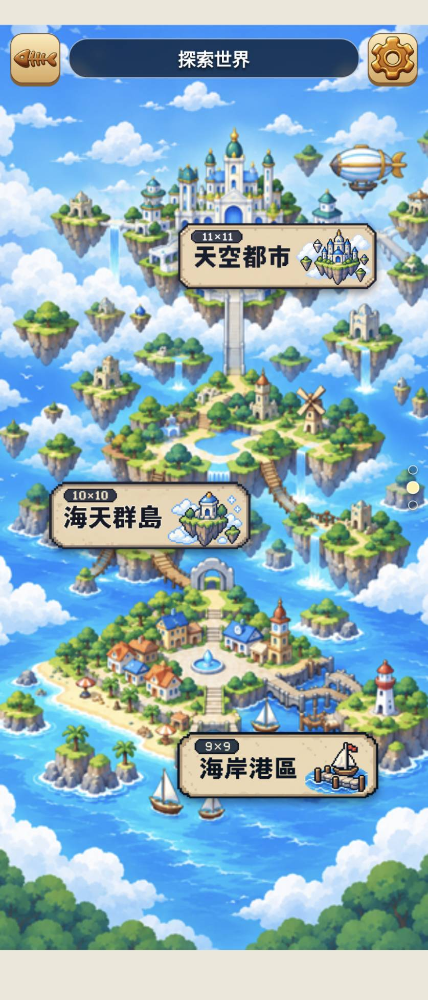
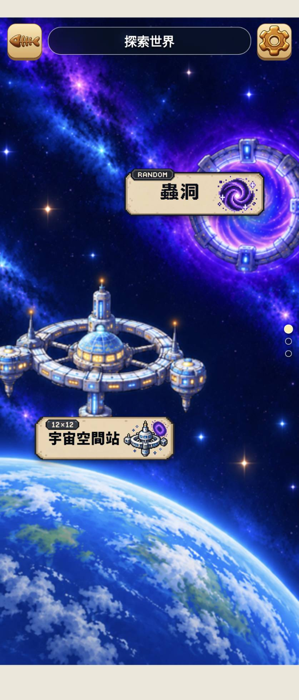
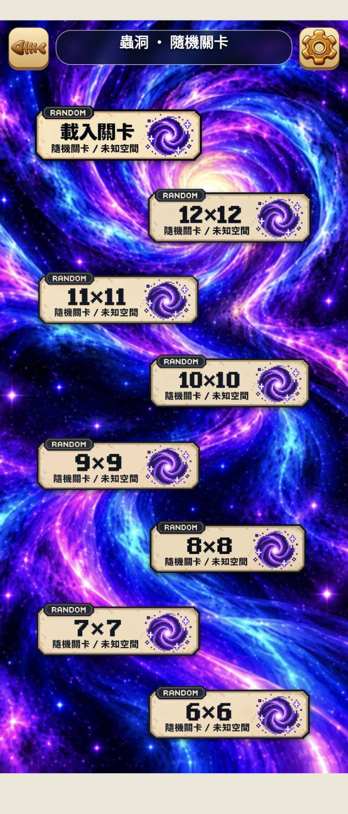
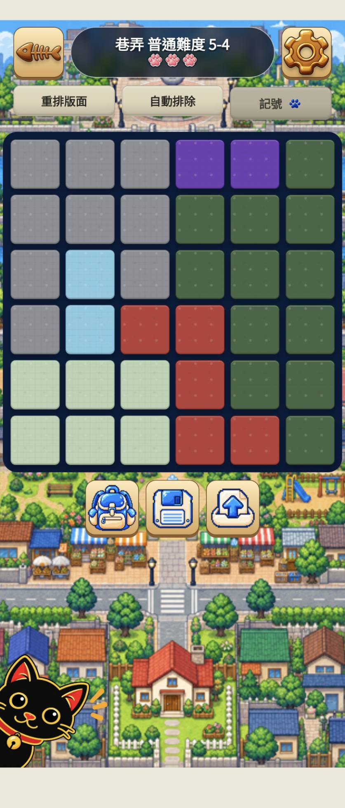
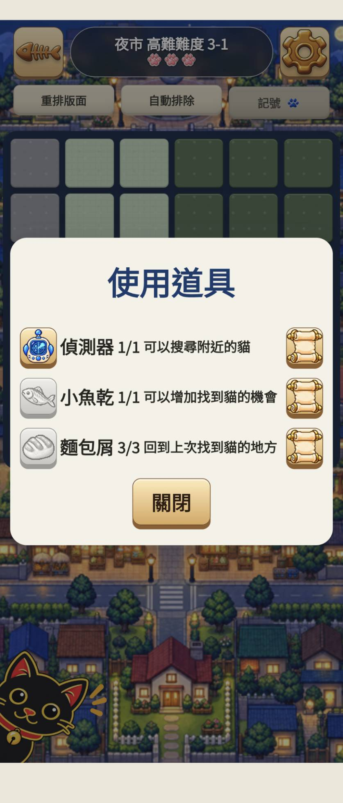
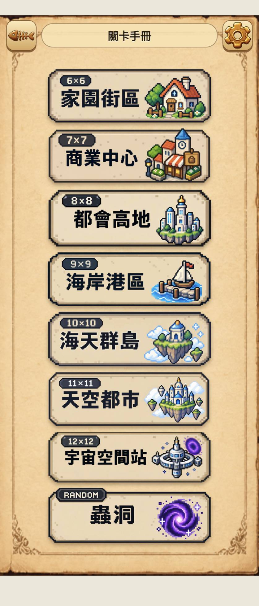
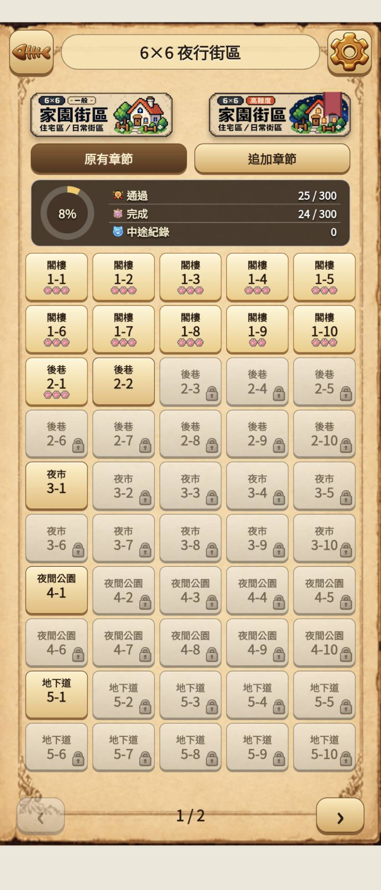

# MeowDoku Android

MeowDoku 是一款以貓咪為主題的 Android 邏輯益智遊戲。根據橫列、直行與顏色區域的限制，找出藏在盤面中的貓咪。

2.0 重新設計探索地圖、關卡手冊與遊戲介面，加入每關固定次數的道具，並以全新關卡與進度系統展開尋貓旅程。

## 下載安裝

[下載最新版 MeowDoku Android v2.0.0 APK](https://github.com/NanbuShirou/MeowDoku_android/releases/download/v2.0.0/Meowdoku.Android.v2.0.0.apk)

[2.0.0 更新說明](https://github.com/NanbuShirou/MeowDoku_android/releases/tag/v2.0.0) · [SHA256SUMS.txt](https://github.com/NanbuShirou/MeowDoku_android/releases/download/v2.0.0/SHA256SUMS.txt) · [舊版 v1.3.2](https://github.com/NanbuShirou/MeowDoku_android/releases/tag/v1.3.2)

- 最低支援 Android 6.0。
- 下載 APK 後開啟檔案，依 Android 提示允許安裝未知來源應用程式。
- 2.0 使用重新生成的關卡與獨立進度，不沿用或混用 1.x 關卡紀錄。
- Android 套件名稱維持不變，安裝 2.0 會更新原有 App，不是與 1.x 同時安裝的另一個 App。
- 請勿為了更新而先移除 App；解除安裝會清除本機紀錄與設定。

## 遊戲規則與操作

每個盤面必須同時符合以下規則：

- 每一橫列恰好有一隻貓咪。
- 每一直行恰好有一隻貓咪。
- 每個顏色區域恰好有一隻貓咪。
- 任意兩隻貓咪不能相鄰，包含上下、左右與斜角。

點一下格子放置或取消提醒記號，快速點兩下猜測貓咪位置；按住拖曳可連續放置相同記號。每場有三次機會，猜錯會扣除一次；過關依剩餘機會獲得 1～3 個肉球，三個肉球代表「完成」。

## 尋找貓貓：主線探索

從家園街區出發，逐步前往商業中心、都會高地、海岸港區、海天群島、天空都市與宇宙空間站，盤面由 6×6 擴展至 12×12。

- 內建重新生成的一般關卡 700 關、高難度關卡 700 關，共 1,400 關。
- 每個尺寸的每種難度有 10 個節點，每節點 10 關。
- 新進度只開放 6×6 普通難度的 1-1。
- 每節點第一關是普通主線：通過 1-1 即開放同節點的 1-2、下一節點的 2-1，以及對應高難度的 1-1。
- 通過目前尺寸的十個普通主線關卡（1-1～10-1），才開放下一尺寸的普通 1-1；不必先完成同尺寸的所有支線。
- 全部 70 關普通主線通過後，開放蟲洞隨機關卡與自由選曲。
- 地圖會顯示解鎖、通過與完成狀態；節點內中途紀錄另外標示，不覆蓋原本的通關狀態。

過關後可返回選關；普通主線第一關及節點最後一關可選「下個地點」，其餘可「繼續深入」同節點。高難度第 1～9 關為「繼續深入」、第 10 關為「下個地點」，目的地仍須已解鎖。

## 關卡手冊與線上追加

關卡手冊可切換一般／高難度與原有／追加章節，每頁 50 關，顯示名稱、肉球與中途紀錄。進度區顯示通過、完成、中途紀錄及完成率。

- 目前線上提供 2,800 關追加關卡：七種尺寸、兩種難度，各追加 200 關；更新後合計 4,200 關固定關卡。
- 追加關卡只出現在關卡手冊，不改變原有主線解鎖規則；對應大關／難度已解鎖後才可遊玩。
- 原有與追加關卡合併納入遊戲歷史、進度分母及完成率。
- 啟動時檢查 2.0 專用的線上更新清單，依 SHA-256 驗證下載內容；新增關卡不必重新安裝 APK。
- 實際追加數量依線上清單為準；更新失敗時保留可用的內建／已快取關卡。
- 線上關卡更新不包含程式本體更新；新版 App 仍從 GitHub Release 下載。

## 蟲洞：隨機與分享關卡

完成全部主線後，可使用 6×6～12×12 隨機關卡與分享碼載入功能。

- 即時生成關卡，記錄各尺寸的過關次數、最快時間與最高分數。
- 過關後可保存並命名分享碼；已保存清單只顯示名稱。
- 選擇已保存關卡會將分享碼帶入輸入欄，方便複製，再按載入進入遊戲。
- 分享碼支援完整盤面與校驗，舊版分享碼仍可讀取。
- 由分享碼載入的關卡不列入隨機過關次數、最快時間、最高分數、找到貓咪數及猜錯次數。

## 使用道具與中途紀錄

遊戲下方提供背包、存檔、上傳盤面，以及僅限隨機關卡的分享按鈕。背包每列依「道具圖示／名稱／剩餘數量／簡短說明／說明按鈕」排列，說明視窗顯示道具圖片、效果與故事。

- 偵測器：每次全新挑戰 1 次；選格後預覽中心與上下左右的十字範圍，按「是」才消耗並揭露結果，取消不扣次數。
- 小魚乾：每次全新挑戰 1 次；增加一次機會，機會已滿時不可使用。
- 麵包屑：每次全新挑戰 3 次；回到最近找到貓後的盤面與標記，不回復生命、時間、分數或已使用的道具。
- 沒有商店、掉落、廣告或其他道具補充方式。
- 保存中途紀錄後可離開，下次繼續原挑戰；載入紀錄保留道具剩餘次數，不補滿。

## 遊戲歷史與設定

遊戲歷史統計一般／高難度固定關卡的通過、完成、肉球及中途紀錄，也記錄隨機成績、猜錯、找到貓咪數及遊玩時間。

- 一般介面採固定淺色配色，遊戲方塊區域保留深色背景，各尺寸與難度使用專屬場景。
- 提供原始、像素、磁磚、紙張四種方塊風格，以及 12 種區域顏色調整。
- 各尺寸與難度使用專屬 BGM；主線未完成前，只開放音樂開啟／關閉。
- 全部主線通過後，可調整音量、自由選曲、試聽及單曲／全曲循環；依關卡配樂模式固定單曲循環，全曲循環由選中的曲目開始。
- 保留震動、自動排除與提醒記號等設定。
- 2.0 已針對大盤面與四種風格調整繪製方式，實際流暢度仍依裝置而異。

## 遊戲畫面

| 遊戲初始畫面 | 主選單 |
| --- | --- |
|  |  |

| 探索世界－家園與都會 | 探索世界－海天與天空 |
| --- | --- |
|  |  |

| 探索世界－宇宙與蟲洞 | 蟲洞隨機關卡 |
| --- | --- |
|  |  |

| 一般關卡遊戲畫面 | 使用道具 |
| --- | --- |
|  |  |

| 關卡手冊入口 | 關卡進度與選擇 |
| --- | --- |
|  |  |

## 檔案驗證

檔名：`Meowdoku.Android.v2.0.0.apk`

版本：`2.0.0`（versionCode `200`）

檔案大小：`102,027,868` bytes

```text
SHA-256: 8CD024A358A8F11F6C83B8A619E1EAC8DF61E8FF2F8A11F88D03CB9FCA66DD22
```

可使用 Windows PowerShell 的 `Get-FileHash -Algorithm SHA256` 與上方校驗值核對。

## 關於此倉庫

本倉庫提供 Android APK、遊戲使用說明、遊戲畫面與線上關卡更新內容，不提供 Android 專案原始碼。特別感謝 yocox。
